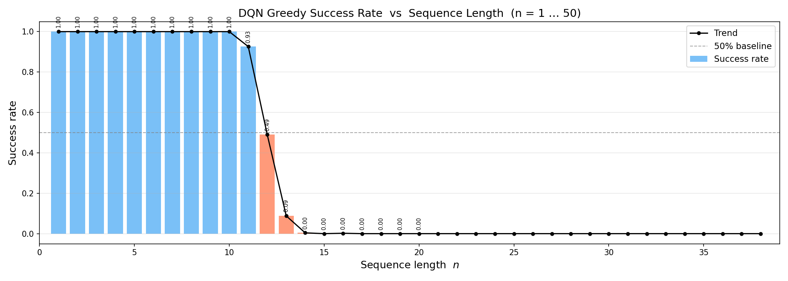
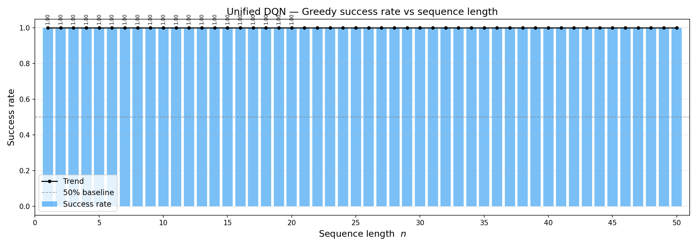

## Overview

I implemented two versions. The first is a standard DQN; after completing Tasks 1 and 2, I revised it to obtain the second version. Code repository: https://github.com/zzx-peter/DQN_Mini_Project.

I kept the first version to show the improvement I made in Task 3.

## Baseline DQN

The baseline adheres to the canonical DQN formulation: an online Q-network, a target network updated via periodic hard synchronization, experience replay, and ε-greedy exploration. The environment is built as a custom Gymnasium interface.

### Network architecture

**Observation–action interface.** The observation is a vector of length 2n+1: the first n components encode the target bit string, the next n the generated prefix (zeros where positions remain unfilled), and the final component the normalized timestep step/n. The action space is binary discrete, corresponding to emitting 0 or 1 at the next position. The network thus outputs two logits—one Q-value per discrete action—and the policy constructs the sequence token by token over n steps rather than emitting the entire string at once.

**Architecture.** `network.py` defines a fully connected MLP: stacked `Linear → ReLU` layers, terminated by a `Linear` layer without activation that maps the state to two action values. Default hidden widths are (256, 256); hidden width may be increased when sequences are long or training is unstable.

**Training.** `agent.py` holds the online network `q_net` and a structurally identical target network `target_net`. Every `target_update_freq` gradient steps (default 200), the target network is hard-copied from the online network. The objective is Smooth L1 (Huber); the Bellman target is  
$y = r + \gamma \max\_{a'} Q\_{target}(s', a') \cdot (1 - done)$, with discount $\gamma = 0.99$. Training uses Adam at learning rate 1e-3 and batch size 128; gradients are clipped (max_norm=10) to limit divergence. The replay buffer capacity defaults to 30000.

### Visualization

**Success rate versus sequence length n.** With `evaluate.py`, checkpoints trained for each length are evaluated under sparse terminal rewards using fully greedy rollouts (default: 500 episodes per n). Success requires exact equality between generated and target strings; results are summarized in Figure 1. In experiments, the success rate remains 1.0 as n increases from 1 to about 10; it falls to approximately 0.926 at n = 11, 0.49 at n = 12, 0.088 at n = 13, 0.004 at n = 14, and approaches 0 for n ≥ 15 under this configuration. Qualitatively, success rate falls off sharply as n grows, consistent with exponential growth of the search space.

**Figure 1.** Greedy evaluation success rate of the baseline DQN versus sequence length $n$.

## Challenges and Improvement

On long sequences, the baseline is limited in two ways: observation dimensionality grows with n, which impedes reusing one network across different lengths; and rewards are nearly absent until the episode terminates, which defers credit assignment and undercuts sample efficiency and exploration. The improved variant (in `DQN_final/`) addresses this through compressing the state so that input size is independent of n, and issuing immediate rewards tied to each decision to strengthen per-step learning signal. The subsections below outline the motivation, the design choices, and the observed benefits.

### The Dim of Observation

In the baseline environment, observations are (2n+1)-dimensional: the full target string, the full generated prefix (zero-padded), and the normalized timestep. For this task, choosing the next bit depends only on the target bit at the position currently being filled (together with a progress cue); the other components are largely redundant. Because the observation tensor’s shape depends on n, each length typically calls for its own trained checkpoint.

The revised design adopts a two-dimensional observation—the target bit at the current index and step/n—which yields constant input dimensionality regardless of sequence length. A single Q-network may be trained under one setup and deployed across multiple values of n at evaluation, greatly reducing the operational cost of maintaining one model per length.

### Sparse Reward

In the baseline environment, intermediate steps receive reward zero; reward appears only on the terminal transition, either as sparse 0/1 (perfect match) or as shaping proportional to the fraction of matching bits. The trajectory therefore carries little signal until the end, which complicates learning a policy that tracks the target incrementally, particularly for large n.

The improved version assigns reward immediately after each bit is committed. Under reward shaping, a correct bit earns 1/n, yielding rewards that are dense and aligned with each action, encouraging bit-wise correctness and easing credit-assignment on long horizons.

### Overall improvement

We train with n = 50 and a fixed episode budget (episodes = 20000), then run greedy evaluation from n = 1 to 50 and report the success rate in Figure 2.

**Figure 2.** Greedy evaluation success rate of the improved DQN versus sequence length $n$.

## Summary

During this mini project, I have two findings:

1. **The observation space should be align with what the policy actually needs, and keep its shape stable across problem scales**. When the minimal sufficient statistics for the next decision do not depend on sequence length, encoding the full 2n+1 context forces a separate model per n and wastes capacity on redundant features. A fixed low-dimensional observation—here, the target bit at the current index together with normalized steps—lets one network generalize across lengths and simplifies training and deployment.

2. **Sparse terminal rewards make credit assignment difficult; denser, step-wise feedback usually learns faster.** If only the final transition carries non-zero reward, the agent receives almost no gradient information about early actions until the episode ends, which is especially harmful for long horizons. Providing immediate reward after each decision (e.g., per-bit correctness) ties the return to the action that caused it and yields a much more informative learning signal than delayed, all-or-nothing feedback alone.